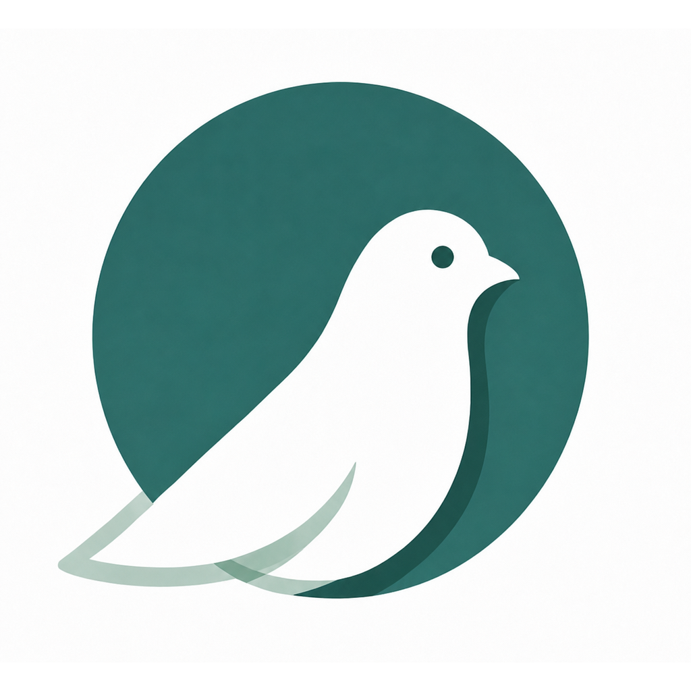

# Pige

## Your general Agent, grounded in what you know.

Pige is a local-first general-purpose Agent with personal knowledge as its strongest
advantage. Ask, paste, or drop something once; Pige answers now and keeps useful narrative
and structured knowledge growing locally without making you supervise every step.

The same Agent decides whether to answer directly, retrieve, inspect, parse, OCR,
analyze, or grow durable knowledge. Pige preserves attached sources and constrains
tools, but does not replace that decision with format rules or a fixed workflow.

**Your files remain sources. Open local knowledge stays yours.** Markdown holds narrative
knowledge; Dataset Bundles hold structured knowledge. No folder, schema, tag, title, or
capture mode is required before you begin.

> Pige is in **active pre-alpha development**. There is no public installer yet. Do
> not use it as the only copy of important knowledge.

## Input once. Knowledge grows naturally.

**Ask or drop → Agent decides → Knowledge keeps growing**

Pige answers normally when local evidence is irrelevant. When material matters, Pi selects
bounded tools to preserve, understand, connect, and maintain cited Markdown autonomously;
operation history and undo replace routine approval.

## Why Pige

Most assistants forget your working context; note apps ask you to organize too early.
Pige combines a **general Agent** with a local knowledge compiler that can remember
useful work beyond one conversation.

- **Conversation when you need it, durable knowledge when it matters.**
- **Inspectable and portable.** Sources and citations stay attached; Markdown and
  Dataset Bundles are durable truth, while indexes and caches are rebuildable.
- **Calm outside, strong inside.** Complex tools and safeguards stay behind useful defaults.

## Current Status

Today, the pre-alpha can:

- Capture text, web pages, Markdown, TXT, PDF, DOCX, PPTX, and images while preserving
  files as managed copies or verified references.
- Extract structured document content and run supported macOS Vision OCR paths.
- Run preserved text and supported PDF/DOCX/PPTX/images through embedded Pi, isolated BYOK binding,
  bounded inspect/parse/OCR tools, and validated knowledge publication.
- Generate source-backed Markdown and run a bounded cited Home knowledge-answer path.
- Review an exact staged create-note proposal from Home; this is a transitional exception path.
- Use persistent-job recovery and local-backup foundations.

Unified text/one-file/static-URL Provider-to-Home plus exact durable follow-up now runs.
Autonomous knowledge growth and broader recovery remain pre-alpha work. See the [implementation playbook](docs/V0_1_IMPLEMENTATION_PLAYBOOK.md).

## Road to `v0.1 Public Alpha`

- **Complete autonomous knowledge growth:** eligibility, Activity/Undo, and exceptional
  recovery across normal note/link/organize work.
- **Finish the Agent spine:** multi-source work, cross-platform document/OCR, and stronger recovery.
- **Ship a trustworthy alpha:** backup/restore, accessibility, localization, packaged
  macOS/Windows proof, signing, and updates.

Sync, mobile, and collaboration come later. See the [roadmap](docs/MILESTONES.md) and
[product requirements](docs/PRD.md).

## Local-first, with honest boundaries

Your vault and durable truth remain local; that is a data-ownership principle, not a
confirmation workflow. Pige requires no cloud account or telemetry. Once connected, a
BYOK provider receives bounded selected context seamlessly—not the whole vault by default.

## Built and maintained by AI Agents

**Built by Agents. Directed by humans.**

AI Coding Agents author and maintain Pige's implementation code. Humans set direction,
review evidence, and authorize releases. Contracts, tests, traceability, and CI are the
project memory on the path toward safe planning-to-release automation.

## Follow the build

Watch for the first Public Alpha, explore the [vision](docs/VISION.md), or help through
[Contributing](CONTRIBUTING.md).

For AI Coding Agents: start with [repository instructions](AGENTS.md) and the
[task router](docs/START_HERE_FOR_AI_AGENTS.md).

[Security](SECURITY.md) · [Privacy](PRIVACY.md) · [Support](SUPPORT.md) ·
[Code of Conduct](CODE_OF_CONDUCT.md) · [Apache 2.0](LICENSE)
