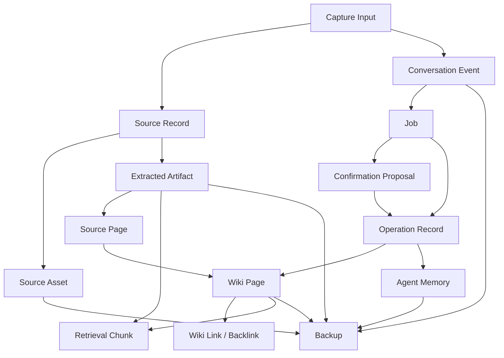

# Domain Model

Status: Draft baseline
Date: 2026-07-09

## 1. Purpose

This document defines Pige's core nouns, ownership boundaries, IDs, and lifecycle concepts. It exists so future AI agents use the same language when implementing features.

If two agents use different meanings for "source", "note", "artifact", "memory", or "conversation", the codebase will drift. This file is the shared vocabulary.

## 2. Core Object Model

## 3. Glossary

| Term | Meaning | Durable owner |
| --- | --- | --- |
| Knowledge root | The local folder containing Markdown knowledge, source pages, wiki pages, control files, and durable vault metadata. | Filesystem |
| Managed-copy root | The configured root for Pige-owned source copies. The v0.1 in-vault default is `<knowledgeRoot>/raw`; an external root is a machine-vault binding. | Source Storage Service |
| Artifact root | The portable root for durable derived artifacts. The v0.1 location is `<knowledgeRoot>/artifacts` and it does not move when the managed-copy root changes. | Source Storage Service and Parser/OCR Services |
| Source asset root | Compatibility/UI term used by the v1 config and IPC DTO for the managed-copy root. It is not a parent of both `raw/` and `artifacts/`. New contracts use `managedCopyRoot` and `artifactRoot`. | Source Storage Service |
| Source asset | Original evidence or Pige-managed copy: file, HTML snapshot, pasted large text body, image, PDF, DOCX, PPTX, folder, repo, archive, or external reference. | Source Storage Service |
| Source storage strategy | How Pige keeps access to a source asset: managed copy, original-path reference, or future explicit filesystem link. | Source Storage Service |
| Source record | Operational metadata about a captured input, including ID, kind, storage strategy, checksums, timestamps, original URI, root-aware managed-copy locator, and artifact references. | Canonical sidecar under `.pige/source-records/` |
| Source page | A user-editable Markdown summary that references one canonical source-record sidecar. It is not a second source-record authority. | `sources/` |
| Artifact | Extracted text, OCR output, rendered page image, normalized asset, or parser output derived from a source asset. | `artifacts/` |
| Wiki page | A durable Markdown knowledge page of type `note`, `concept`, `entity`, `topic`, `claim`, or `question`. A project is represented by an entity/note; `index.md` and `log.md` are special control files, not ordinary page types. | `wiki/` |
| Tag | Lightweight frontmatter facet used for filtering and ranking, not the main knowledge hierarchy. | Markdown frontmatter plus rebuildable indexes |
| Knowledge relation | Typed connection such as wiki link, citation, topic membership, support, contradiction, duplicate, or supersession. | Markdown/frontmatter/managed sections/operation records |
| Knowledge Tree | Derived semantic visualization of topics, concepts, sources, fragments, claims, questions, and relationship suggestions. | Rebuildable view |
| Asset | Local image or attachment used by Markdown pages. | `assets/` |
| Conversation event | Reference-based chat timeline event. Stores user/assistant turns, job references, permission decisions, and short messages without duplicating large source asset bodies. | `.pige/conversations/` |
| Job | Recoverable unit of work such as capture, parse, OCR, ingest, query, index rebuild, backup, restore, permissioned Skill run, tool/model install, or migration. | `.pige/jobs/` for vault jobs, OS app data for machine-local jobs, plus rebuildable SQLite index |
| Proposal | Confirmation-required planned change before it mutates durable wiki state. | `.pige/proposals/` |
| Operation record | Applied user, Agent, system, Skill, package, or migration change record for lifecycle audit, policy evidence, rollback when possible, and future sync reconciliation. | `.pige/operations/` |
| Agent memory event | Raw memory input such as explicit remember, accepted correction, accepted proposal, failed action lesson, or preference. | `.pige/memory/events/` |
| Agent memory atom | Compact durable memory statement derived from memory events. | `.pige/memory/atoms/` |
| Memory scenario | Contextual workflow lesson or pattern. | `.pige/memory/scenarios/` |
| Retrieval chunk | Rebuildable unit used for lexical/vector retrieval. | SQLite/indexes |
| Provider profile | Machine-local model provider configuration. | App settings plus secret store |
| Default model | The selected model profile that Pi Agent calls by default. | App settings |
| Setting | User-visible or internal preference with declared owner, scope, storage, backup behavior, permission requirement, and apply behavior. | `.pige/config.json`, app settings, secret store, or permission store depending on scope |
| Setting scope | Classification such as vault-portable, machine-local, machine-vault binding, secret, permission grant, derived status, or transient state. | `docs/SETTINGS_AND_PREFERENCES.md` |
| Skill | Human-readable workflow extension. Pure Skills are Markdown instruction packs; external/Web Skills may request capabilities. | App bundle, `.pige/skills/`, or app data |
| Package | Reviewed Pi package or future extension package that can provide capabilities, tools, or Skills. | App data and Package Manager records |
| Local tool | Bundled or explicitly downloaded tool/model runtime such as Git, Bun, uv, PDF parser, PaddleOCR, or Qwen embedding model. | App bundle/app data |
| Permission request | Runtime authorization prompt for sensitive Agent, Skill, package, tool, model, network, filesystem, secret, settings, or destructive actions. | Machine-local permission store |
| Backup | Portable zip containing durable vault data according to backup policy. | User-selected output path |
| Diagnostic event | Redacted machine-local operational record used to understand failures without storing user content or secrets. | OS app data diagnostics store |
| Support bundle | User-initiated local diagnostic export, redacted by default and previewed before creation. | User-selected output path |

## 4. Durable Truth Vs Working State

Durable Markdown knowledge truth:

- Source pages.
- Wiki pages.
- Local assets.
- `PIGE.md`, `index.md`, `log.md`.
- Conversation events.
- Vault-scoped Agent memory.
- Vault-scoped Skills.
- Proposals and operation records.
- Vault manifests and non-secret vault config.

Durable source evidence:

- Source records.
- Managed source copies.
- Downloaded web snapshots.
- External original file references.
- Explicit source links when supported.

Durable but regenerable artifacts:

- Extracted text.
- OCR artifacts.
- Rendered source previews.
- Parser metadata.

Machine-local durable state:

- Current vault path.
- Window state.
- Provider profiles, model profiles, and default model selection.
- Installed tool/model state.
- Permission grants.
- Machine-local Skills/packages.

Rebuildable state:

- SQLite database.
- FTS and vector indexes.
- Thumbnails.
- Search caches.
- Retrieval chunks derived from pages/artifacts.

Secrets include authentication credentials for providers, registries, and future sync,
plus release-signing material or equivalent confidential tokens. Exact storage and
lifecycle rules are owned by `docs/DATA_ARCHITECTURE.md` and the security contract.

## 5. ID Rules

IDs must be stable, sync-ready, and independent from file paths.

Canonical ID prefixes:

`packages/schemas/src/index.ts` is the executable authority for formats. This table is the human vocabulary and must not introduce aliases.

| Prefix | Object |
| --- | --- |
| `vault_` | Vault |
| `src_` | Source |
| `page_` | Wiki or source page |
| `cap_` | Capture request/batch |
| `asset_` | Asset |
| `art_` | Extracted artifact |
| `conv_` | Conversation |
| `evt_` | Conversation event |
| `job_` | Job |
| `proposal_` | Confirmation/change proposal |
| `op_` | Operation record |
| `mem_event_` | Memory event |
| `mem_atom_` | Memory atom |
| `chunk_` | Retrieval chunk |
| `skill_` | Skill |
| `pkg_` | Package |
| `permreq_` | Permission request |
| `permdec_` | Permission decision |
| `backup_` | Backup manifest |
| `root_` | Machine-local external root binding |

Rules:

- Do not infer identity from title or slug.
- Slugs can change; IDs should not.
- Store ID in frontmatter or manifest for durable objects.
- Use checksums for managed source copy deduplication and for referenced originals when accessible.
- Use `updated_at`, previous checksum, and operation records for conflict detection.
- Future sync must be able to distinguish same-object edits from duplicate-object creation.
- Retired aliases `pg_`, `artifact_`, and `event_` must not be emitted. Readers may preserve a documented legacy ID for compatibility, but migrations must not silently rename a durable object; all new objects use the canonical prefix.

## 6. Page Types

Primary v0.1 page types:

- `source`: one captured source.
- `note`: flexible memo, summary, research, meeting, draft, or imported knowledge page.
- `concept`: evergreen concept page.
- `entity`: person, organization, product, place, or other named entity.
- `topic`: broad area that groups pages.
- `claim`: source-backed assertion.
- `question`: an open, partially answered, answered, or stale question.

Rules:

- Source pages preserve provenance.
- Wiki pages synthesize knowledge.
- Claim pages require evidence references.
- Projects use `entity.entity_type: "project"` or a `note`; `project` is not a page-type enum value.
- `index.md` and `log.md` are special durable control files, not ordinary `type` values and not database views.

## 7. Job States

`docs/JOB_OPERATION_AND_RECOVERY.md` is the detailed authority for job classes, state transitions, checkpoints, retry, cancellation, compaction, proposals, operations, and crash recovery.

Canonical states:

- `queued`.
- `running`.
- `waiting_dependency`.
- `waiting_permission`.
- `awaiting_review`.
- `cancel_requested`.
- `completed`.
- `completed_with_warnings`.
- `failed_retryable`.
- `failed_final`.
- `cancelled`.
- `compacted`.

`packages/schemas/src/index.ts` owns the executable `JobClassSchema`, `JobStateSchema`, and `JobRecordSchema`. Other documents and DTOs reference those schemas rather than copying alternate class or state names. The durable field is `state`; `status` is reserved for API action results and other non-job summaries.

Rules:

- Source record creation and source preservation should happen before expensive work.
- A crash must not lose queued or partially processed captures.
- Jobs waiting for permission must resume or fail clearly after restart.
- Failed jobs remain visible until resolved or explicitly cleared.
- Successful jobs may compact detail after the retention window, but not conversation turns, operation summaries, or `log.md` entries.

## 8. Confirmation And Operation Model

Confirmation proposal:

- Planned change.
- May include full proposed Markdown.
- Must show paths, summaries, warnings, and diffs/previews.
- Can be approved, rejected, or revised.

Operation record:

- Applied change.
- Prefer patches, checksums, summaries, timestamps, and paths over full duplicated content.
- Must be attributable to job, model profile, Skill/package when relevant, and permission decision when relevant.
- Model-, permission-, source-policy-, and settings-sensitive operations record the redacted policy context ID/hash and enforcing owners, never a settings snapshot or secret.
- Used for audit and best-effort rollback.

Rules:

- Risky edits require confirmation.
- Deletes, merges, vault structure changes, and `PIGE.md` edits require explicit confirmation.
- Operation records do not become a hidden duplicate knowledge base.
- Proposal and operation lifecycle details live in `docs/JOB_OPERATION_AND_RECOVERY.md`.

## 9. Memory Model

Memory layers:

- L0 memory events: raw events from explicit remembers, accepted corrections, accepted proposals, failed actions, and job outcomes.
- L1 memory atoms: concise durable memories.
- L2 scenarios: contextual workflow patterns.
- L3 profile: optional higher-level preferences and conventions.

Rules:

- Memory is not a replacement for notes.
- Memory must be inspectable and support disable, delete, export, and reset actions.
- Secrets must be scanned before persistence.
- Sensitive or broad behavior-changing memory requires confirmation.
- Vault-scoped memory is included in backup by default unless excluded.

## 10. Permission Model

A `PermissionGrant` records a user decision over a versioned actor, capability, bounded
resource/data scope, and duration. `docs/SECURITY_THREAT_MODEL.md` is the sole owner of
eligible actors, required record dimensions, grant scopes, and enforcement semantics;
domain code must consume that shared contract rather than introduce another permission
vocabulary.

Default permission modes:

- Ask Every Time.
- Remember Scoped Grants.
- YOLO Full Access.

Sensitive capabilities:

- Vault read/write/delete beyond current job scope.
- External filesystem read.
- External network.
- Shell execution.
- Package or local tool install/update.
- Cloud model call with large/private source.
- Secret access.
- Settings or schema change.
- Spawn Agent/background task.

Rules:

- Permission Broker owns sensitive runtime authorization.
- Grants must be scoped, revocable, and machine-local by default.
- Denial must leave the app stable and explainable.
- YOLO Full Access can only be enabled by the human user in Settings.
- YOLO Full Access suppresses covered prompts but still produces permission and operation logs.
- Source content, Skill instructions, package code, local tools, and model output cannot enable or expand permission modes.

## 11. Service Ownership

| Object or action | Owning service |
| --- | --- |
| Knowledge root paths and atomic Markdown/metadata writes | Vault Service |
| Source records, source assets, managed copies, original references | Source Storage Service |
| Source preservation during capture | Capture Service and Source Storage Service |
| Parser output and OCR artifacts | Parser/OCR Services |
| Markdown generation and frontmatter | Wiki Compiler |
| Tags, relationship writes, and backlink maintenance | Wiki Compiler, with graph indexes owned by Local Database Service |
| Confirmation proposals | Change Proposal Service |
| Operation records | Change Proposal Service / Vault Service |
| Conversation events | Conversation History Service |
| Agent memory | Agent Memory Service |
| SQLite and migrations | Local Database Service |
| Retrieval chunks and indexes | Search and Retrieval Service |
| Model provider calls | Model Provider Registry |
| Permission prompts and grants | Permission Broker |
| Skill metadata and selection | Skill Registry Service |
| Package install/update records | Pi Package Registry Service |
| Tool/model downloads | Local Tool Service |
| Backup/restore manifests | Backup Service |
| Window state | Window and Layout Service |

## 12. Anti-Confusion Rules

- A captured Markdown file is a source until the user or Agent turns it into wiki knowledge.
- A source page is not the source asset.
- An artifact is not authoritative; it can be regenerated.
- A retrieval chunk is not a note.
- A tag is not a topic, concept, entity, or folder.
- Knowledge Tree is a visualization over Markdown and graph indexes, not a separate source of truth.
- Conversation history is activity history, not the canonical wiki.
- Memory is behavioral context, not general knowledge storage.
- A database row is not durable knowledge unless backed by a durable file.
- A Skill is not permission by itself.
- A package being installed does not mean every capability is allowed.
- A backup is not sync, but it must preserve sync-ready IDs.
